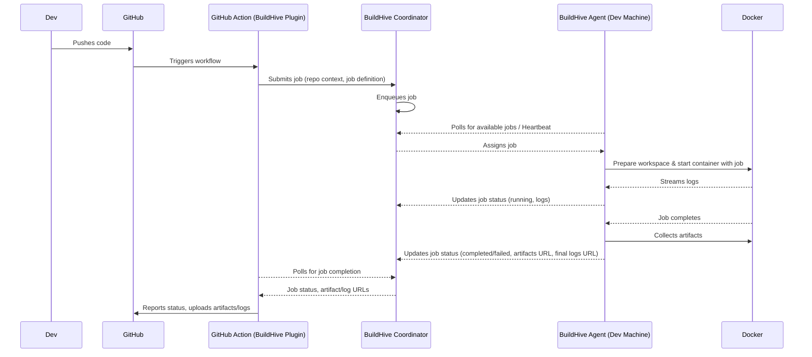

# BuildHive Developer README

This document is for BuildHive developers and contributors. It provides an overview of the project architecture, MVP goals, technical tasks, contribution guidelines, and other developer-centric information.

For the public-facing README, see [README.md](README.md).

## 🎯 Goals

*   Provide clarity on the project architecture.
*   Define MVP scope and responsibilities.
*   Track technical tasks.
*   Point to relevant internal tools and decisions.

## 1. Project Overview

**What is BuildHive trying to solve (in technical terms)?**

BuildHive aims to reduce CI build times and costs by intelligently distributing CI workloads (initially focusing on Dockerized jobs, like Android or general Linux builds) from standard cloud runners to a network of developer machines (agents) when they are idle. It involves a central coordinator service to manage agents and jobs, a lightweight agent running on developer machines, and integration with CI systems like GitHub Actions.

**Tech Stack Summary:**

*   **SaaS Platform (UI & Core User Management):** [OpenSaaS.sh](https://opensaas.sh/) template using [Wasp](https://wasp.sh/) (React, Node.js, Prisma, PostgreSQL). Located in `app/`.
*   **Coordinator API:** Kotlin with [Ktor](https://ktor.io/) for managing agents, job queuing, and persistence. PostgreSQL for database. Redis/RabbitMQ for job queue. Located in `coordinator/`.
*   **Agent CLI:** Kotlin Native CLI that runs on developer machines (macOS, Linux). Interacts with the Coordinator API and executes jobs, primarily using Docker for isolation. Located in `agent/`.
*   **CI Integration:** Initially a GitHub Actions custom plugin/action. Located in `ci-plugin/`.
*   **Job Isolation:** Docker.
*   **Shared Logic (Coordinator & Agent):** Potential for Kotlin Multiplatform (KMP) in `shared-kmp/`.

## 2. How It Works (High-Level Flow)

**Detailed Flow:**

1.  **Developer pushes code** to a repository with BuildHive integrated.
2.  **GitHub Action triggers** on the push or pull request.
3.  The **BuildHive GitHub Action** (from `ci-plugin/`):
    *   Packages necessary build context (e.g., source code, Dockerfile).
    *   Authenticates with the BuildHive Coordinator.
    *   Submits the job definition (including context URI, Docker image, commands) to the Coordinator.
4.  **BuildHive Coordinator** (`coordinator/`):
    *   Authenticates the request.
    *   Validates the job definition.
    *   Persists job details (PostgreSQL).
    *   Places the job in a queue (Redis/RabbitMQ).
5.  **BuildHive Agent** (`agent/`), running on an idle developer machine:
    *   Periodically polls the Coordinator for available jobs matching its capabilities.
    *   Sends heartbeats to maintain its active status.
6.  **BuildHive Coordinator** assigns a job from the queue to a suitable, available agent.
7.  **BuildHive Agent**:
    *   Receives job details.
    *   Updates job status to `RUNNING` with the Coordinator.
    *   Downloads job context (if URI provided).
    *   Prepares a secure workspace.
    *   Uses Docker to pull the specified image and run the job commands in an isolated container.
    *   Streams logs from the container back to the Coordinator (or to a designated log storage, then notifying Coordinator).
    *   Upon completion, collects artifacts from the container.
    *   Uploads artifacts to a designated storage (e.g., S3).
    *   Updates job status to `COMPLETED` or `FAILED` with the Coordinator, providing URLs to final logs and artifacts.
8.  The **BuildHive GitHub Action** polls the Coordinator for the job's final status.
9.  Once the job is `COMPLETED` or `FAILED`:
    *   The Action retrieves log and artifact URLs from the Coordinator.
    *   Downloads them and makes them available in the GitHub Actions workflow results.
    *   Reports the final status to GitHub.
10. **Fallback Mechanism (Conceptual):** If no suitable BuildHive agent is available within a timeout, the Coordinator could signal the GitHub Action to fallback to a standard cloud runner.

## 3. MVP Goals & Detailed Plan

This section breaks down the MVP features into smaller, actionable tasks.

**Guiding Principles for Development:**

*   **Small, Incremental Changes:** Each task should represent a manageable unit of work.
*   **Test Coverage:** All new functionality must be accompanied by relevant tests (unit, integration, E2E). See "Testing Strategy" below.
*   **Clear Acceptance Criteria:** Each task should have clear conditions that define its completion.

---

### Phase 1: Coordinator & Agent Core

**Overall Goal:** Establish the basic communication and job handling between the Ktor Coordinator service and a Kotlin Native Agent.

**1.1. Scaffold OpenSaaS Template**
*   **Status:** [x] Done
*   **Details:** The Wasp application under `app/` is the result of this.
*   **Key Files:** `app/main.wasp`, `app/schema.prisma`, `app/src/`
*   **Acceptance Criteria:** Basic Wasp application runs; default OpenSaaS pages accessible.
*   **Testing:** Manual verification.

**1.2. Ktor Coordinator Service: Basic Setup & API Endpoints**
*   **Goal:** Initial Ktor server with API endpoints for agent registration, heartbeat, job polling, and status updates.
*   **Key Files/Modules (`coordinator/`):** `build.gradle.kts`, `src/main/kotlin/Application.kt`, `Routing.kt`, `model/Agent.kt`, `model/Job.kt`.
*   **Tasks:** Setup Ktor project; define `POST /api/v1/agent/register`, `POST /api/v1/agent/heartbeat`, `GET /api/v1/jobs/next`, `PUT /api/v1/jobs/{jobId}/status`; initial in-memory data models.
*   **Acceptance Criteria:** Server runs; endpoints reachable; basic request/response validation.
*   **Testing:** Unit tests for routing; integration tests for API endpoints (Ktor test engine).

**1.3. Agent CLI: Basic Setup & Communication**
*   **Goal:** Minimal Kotlin Native CLI agent to register with coordinator and send heartbeats.
*   **Key Files/Modules (`agent/`):** `build.gradle.kts`, `src/nativeMain/kotlin/Main.kt`, `ApiClient.kt`.
*   **Tasks:** Setup Kotlin Native project; implement calls to `/register` and `/heartbeat`; basic config.
*   **Acceptance Criteria:** Agent compiles, runs, registers, and sends heartbeats (verified by coordinator).
*   **Testing:** Unit tests for API client; manual E2E with coordinator.

**1.4. PostgreSQL Integration for Coordinator**
*   **Goal:** Persist agent and job information in PostgreSQL.
*   **Key Files/Modules (`coordinator/`):** `db/DatabaseFactory.kt`, `db/Schema.kt`, `services/AgentService.kt`, `services/JobService.kt`.
*   **Tasks:** Add DB library (e.g., Exposed); define `Agents` and `Jobs` tables; implement DB connection; refactor API handlers to use services for DB interaction; plan migrations.
*   **Acceptance Criteria:** Coordinator persists data in PostgreSQL; data correctly retrieved/updated via API.
*   **Testing:** Unit tests for services (mocking DB or using H2); integration tests with PostgreSQL.

**1.5. Redis/RabbitMQ Integration for Job Queue**
*   **Goal:** Use Redis/RabbitMQ for job queuing.
*   **Key Files/Modules (`coordinator/`):** `queue/JobQueueService.kt`.
*   **Tasks:** Add client library; implement `enqueueJob` and `dequeueJob`; integrate with new `POST /api/v1/jobs` (for submitting jobs) and existing `/jobs/next` endpoint.
*   **Acceptance Criteria:** Jobs submitted are queued; agents receive jobs from queue.
*   **Testing:** Unit tests for `JobQueueService` (mocking client); integration tests with Redis/RabbitMQ.

**1.6. Agent CLI: Task Execution (Placeholder)**
*   **Goal:** Agent requests a job and simulates execution, updating status.
*   **Key Files/Modules (`agent/`):** `TaskRunner.kt`.
*   **Tasks:** Agent polls `/jobs/next`; if job received, print details, update status to `RUNNING`, simulate work, update status to `COMPLETED`/`FAILED`.
*   **Acceptance Criteria:** Agent fetches job; reports status changes reflected in coordinator's DB.
*   **Testing:** Manual E2E.

---

### Phase 2: CI Integration (GitHub Actions)

**Overall Goal:** Allow a GitHub Actions workflow to submit a job to BuildHive and receive results.

**2.1. GitHub Actions Plugin: Send Job to BuildHive**
*   **Goal:** Basic GitHub Action to package context and submit job to BuildHive.
*   **Key Files/Modules (`ci-plugin/`):** `action.yml`, entrypoint script (`main.sh` or `main.js`).
*   **Tasks:** Define `action.yml` inputs; script job submission to new `POST /api/v1/ci/jobs` (handles API key auth); implement API key auth on coordinator.
*   **Acceptance Criteria:** Workflow uses action; job submitted to coordinator; job appears in queue.
*   **Testing:** Test repo with workflow; mock or dev coordinator.

**2.2. Job Packaging (Initial: Zip)**
*   **Goal:** Define how job context is packaged and made available to agent.
*   **Tasks:** Strategy (zip); storage (S3 presigned URL or coordinator temp storage); CI plugin creates/uploads zip; Coordinator's `/ci/jobs` accepts package URL/payload; Agent downloads/extracts.
*   **Acceptance Criteria:** CI packages files; coordinator stores reference; agent downloads/extracts.
*   **Testing:** E2E: GitHub Action packages, agent downloads/extracts.

**2.3. Artifact and Log Return to CI Step (Basic)**
*   **Goal:** Agent uploads artifacts/logs; CI plugin polls for completion and retrieves them.
*   **Tasks:** Storage for artifacts/logs (S3); Agent uploads and reports URLs to coordinator (`/jobs/{jobId}/status`); Coordinator endpoint `GET /api/v1/ci/jobs/{jobId}/status` for CI polling; CI plugin polls and downloads.
*   **Acceptance Criteria:** Agent uploads dummy log/artifact; CI plugin polls, detects completion, downloads.
*   **Testing:** E2E: Full flow from GitHub Action to artifact retrieval.

---

### Phase 3: Security & Isolation

**Overall Goal:** Enhance security of agent communication and job execution.

**3.1. Docker Sandboxing on Agent**
*   **Goal:** Agent executes jobs within a Docker container.
*   **Key Files/Modules (`agent/`):** `TaskRunner.kt`, Docker interaction logic.
*   **Tasks:** Add Docker interaction library/CLI; job definition includes Docker image/commands; `TaskRunner` downloads package, pulls image, starts container, executes job, streams logs, copies artifacts.
*   **Acceptance Criteria:** Agent executes simple job in Docker; logs captured; artifacts retrieved; isolation verified.
*   **Testing:** Agent runs Dockerized task; verify isolation.

**3.2. JWT or API Key Auth for Agents & CI Plugin**
*   **Goal:** Secure communication between Agent/CI Plugin and Coordinator. (API Key for CI already in 2.1)
*   **Tasks:**
    *   **Coordinator (JWT for Agents):** `POST /api/v1/agent/register` returns JWT; protect agent endpoints (`/heartbeat`, `/jobs/next`, etc.) with JWT auth.
    *   **Agent Token Handling:** Store JWT; include in headers; handle expiry/refresh (simplified for MVP: re-register).
*   **Acceptance Criteria:** Coordinator endpoints protected; unauthenticated requests rejected; Agent authenticates.
*   **Testing:** Integration tests for auth; manual tests with valid/invalid tokens.

---

### Phase 4: Basic Monitoring & Platform (Wasp UI - `app/`)

**Overall Goal:** Provide a simple web interface (Admin Dashboard) to view agent and job status.

**4.1. Platform: Admin Dashboard - Agent Status Page**
*   **Goal:** Display registered agents and their status.
*   **Tasks:**
    *   **Coordinator API:** Implement `GET /api/v1/admin/agents` and `GET /api/v1/admin/agents/{agentId}` (admin auth).
    *   **Wasp (app/):** Define page/route/query in `main.wasp`; Wasp query calls new Coordinator admin API; React component to display agents.
*   **Acceptance Criteria:** Wasp UI lists agents and status; data refreshes.
*   **Testing:** Manual verification; Wasp UI tests if available.

**4.2. Platform: Admin Dashboard - Job Tracking View**
*   **Goal:** Display jobs and their status.
*   **Tasks:**
    *   **Coordinator API:** Implement `GET /api/v1/admin/jobs` and `GET /api/v1/admin/jobs/{jobId}` (admin auth).
    *   **Wasp (app/):** Wasp query calls new Coordinator admin API; React component to display jobs (ID, status, time, agent, log/artifact links).
*   **Acceptance Criteria:** Wasp UI lists jobs and status.
*   **Testing:** Manual verification.

**4.3. Auth & Permissions (Initial - Wasp Default)**
*   **Goal:** Basic user authentication for the Wasp app (Admin Dashboard).
*   **Tasks:** Utilize OpenSaaS/Wasp default email/password or GitHub OAuth for admin users of the dashboard. Specific role-based access beyond admin/non-admin is for future.
*   **Acceptance Criteria:** Admin users can log in to view dashboard.

**4.4. DevOps & Infra (Initial)**
*   **Goal:** Basic setup for local development.
*   **Tasks:** Document Docker setup for PostgreSQL/Redis for local coordinator development; `app/README.md` covers Wasp app local dev.
*   **Acceptance Criteria:** Developers can run components locally.

---

## 4. Architecture Notes

*   **Monorepo Layout:**
    *   `app/`: Wasp-based SaaS application (UI, user auth, platform dashboard).
    *   `coordinator/`: Ktor backend service (Agent API, CI API, job queue, DB persistence).
    *   `agent/`: Kotlin Native CLI (runs on developer machines, executes Dockerized jobs).
    *   `ci-plugin/`: GitHub Action for integrating with BuildHive.
    *   `shared-kmp/`: (Optional/Future) Shared Kotlin Multiplatform code between coordinator and agent.
    *   `docs/`: General documentation, diagrams.
    *   `e2e-tests/`: End-to-end tests.
*   **Core Interfaces & Contracts:**
    *   **Coordinator-Agent API:** Defined by Ktor routes in `coordinator/` (registration, heartbeat, job polling, status updates). Payloads are serialized data classes.
    *   **Coordinator-CI Plugin API:** Endpoint for job submission, API key authenticated.
    *   **Job Definition:** A structured format (e.g., JSON/YAML) specifying Docker image, commands, environment variables, artifact paths, etc. This will evolve.
    *   **Agent Capabilities:** Agents might declare capabilities (OS, specific hardware, software versions) for targeted job assignment in the future. For MVP, assume generic Docker-capable agents.
*   **Data Persistence (Coordinator):** PostgreSQL. Schema managed by Exposed or Flyway/Liquibase.
*   **Job Queuing (Coordinator):** Redis (initially for simplicity) or RabbitMQ.

## 5. How to Contribute

### Running Locally

*   **Wasp Application (`app/`):**
    *   See `app/README.md`. Involves `wasp start db` and `wasp start`.
*   **Coordinator Service (`coordinator/`):**
    *   Requires Java/Kotlin JDK.
    *   Requires running PostgreSQL and Redis/RabbitMQ instances (Docker is recommended for local setup).
    *   Run via Gradle: `./gradlew run` or directly from IntelliJ IDEA.
    *   Configure database and queue connection details (e.g., via environment variables or `application.conf`).
*   **Agent CLI (`agent/`):**
    *   Requires Kotlin Native compiler tools.
    *   Build via Gradle: `./gradlew :agent:linkNative` (or similar, depending on exact native target).
    *   Run the compiled executable. Configure Coordinator URL.
*   **Environment Variables:** Ensure `.env.*.example` files are copied and configured where necessary, especially for database connection strings and API keys.

### Branching Model (Example: GitFlow variant)

*   `main`: Represents the latest released/stable version.
*   `develop`: Integration branch for features. All feature branches are merged into `develop`.
*   `feature/<feature-name>`: Branched from `develop` for new features.
*   `bugfix/<bug-name>`: Branched from `develop` (or `main` for hotfixes) to fix bugs.
*   `release/<version>`: Branched from `develop` when preparing a new release. Only bug fixes and documentation changes here. Merged into `main` and `develop` after release.

### Commit Conventions (Example: Conventional Commits)

Use [Conventional Commits](https://www.conventionalcommits.org/):
`type(scope): subject`

*   **Types:** `feat`, `fix`, `build`, `chore`, `ci`, `docs`, `perf`, `refactor`, `revert`, `style`, `test`.
*   **Scope (optional):** Module affected (e.g., `agent`, `coordinator`, `app`, `ci-plugin`).
*   Example: `feat(agent): Implement Docker task execution`
*   Example: `docs(readme): Update project setup instructions`

### Testing Strategy

(This section incorporates content from the previous `TESTING.MD`)

**Guiding Principles:**

*   Test Early, Test Often.
*   Automate What Matters.
*   Aim for High Coverage for critical logic.
*   Tests as Documentation.
*   Maintainability.

**Types of Tests:**

1.  **Unit Tests:**
    *   **Goal:** Verify individual units of code (functions, methods). Dependencies mocked.
    *   **Tools:**
        *   Kotlin (Coordinator, Agent): JUnit 5, MockK, AssertJ/Kluent.
        *   Wasp (app): Vitest, React Testing Library.
    *   **Location:** `src/test/kotlin`, `src/**/*.test.ts(x)`.
2.  **Integration Tests:**
    *   **Goal:** Verify interaction between components (e.g., API with DB).
    *   **Tools:**
        *   Kotlin (Coordinator): Ktor `testApplication`, Testcontainers (PostgreSQL, Redis).
        *   Wasp (app): Vitest for backend; Wasp utilities.
3.  **End-to-End (E2E) Tests:**
    *   **Goal:** Verify entire application flows from user perspective.
    *   **Tools:** Playwright (`e2e-tests/`); Custom scripts for CLI.

**Testing Strategy by Component:**

*   **Wasp Application (`app/`):**
    *   Frontend: Vitest/RTL for components/hooks.
    *   Backend: Vitest for queries/actions (unit/integration).
    *   E2E: Playwright for user flows.
*   **Ktor Coordinator (`coordinator/`):**
    *   API Endpoints: Ktor `testApplication`.
    *   Service Layer: Unit tests (MockK).
    *   DB/Queue Interactions: Integration tests with Testcontainers.
*   **Kotlin Native Agent (`agent/`):**
    *   CLI Logic: Unit tests.
    *   API Client: Unit tests (mocking HTTP).
    *   Task Execution: Unit tests; Integration for Docker interaction.
    *   E2E (Manual/Scripted): Full agent lifecycle against coordinator.
*   **CI Plugin (`ci-plugin/`):**
    *   Action Logic: Unit tests for scripts.
    *   Integration: E2E with sample GitHub workflow against test coordinator.

**Test Execution:**

*   **Locally:** Before pushing (e.g., `npm test`, `./gradlew test`, `npx playwright test`).
*   **CI Pipeline:** All tests automated on PRs and merges.

**Best Practices:** Clear names, AAA pattern, independent tests, test one thing, mock appropriately, test public API, review/refactor tests.

## 6. Useful OpenSaaS Tools to Leverage

*   ✅ **Stripe Integration (via Wasp):** For future billing tiers and subscriptions for BuildHive services.
*   ✅ **Authentication (Clerk/Auth.js/Wasp's built-in):** For user management in the `app/` dashboard, especially GitHub OAuth for linking developer accounts.
*   ✅ **Feature Flags (if Wasp supports or via external lib):** For staged rollout of new agent capabilities or coordinator features.
*   ✅ **Email Sending (Wasp integration):** For notifications (e.g., agent down, build success/failure summaries).
*   **(Consider) Audit Logs:** For transparency in task execution, agent actions, and administrative changes (could be custom implementation or leverage Wasp capabilities if available).
*   **(Consider) Metrics Dashboards:** For system monitoring (agent capacity, job throughput, queue lengths). Wasp might offer some basics, or integrate with Prometheus/Grafana for coordinator/agent metrics.

## 7. Open Questions / Future Considerations

*   **Agent Prioritization & Selection Strategy:** How does the coordinator pick the "best" agent if multiple are available? (Capabilities, load, historical performance, owner preference?)
*   **Network Resilience & Job State Recovery:** What happens if an agent loses connection mid-job? How are jobs restarted or marked as failed?
*   **Advanced Caching Strategies:** How can builds be sped up further? (Distributed layer caching for Docker, dependency caching).
*   **Security Hardening:** Beyond Docker isolation, what further security measures are needed for agent-host interaction and code execution?
*   **Scalability of Coordinator:** How will the coordinator handle thousands of agents and jobs?
*   **Detailed Resource Management:** How to manage CPU/memory/disk allowances for jobs on agent machines?
*   **Cross-Platform Agent Support:** Windows agent?
*   **More CI System Integrations:** GitLab, CircleCI, etc.

---
This document is a living guide. Please contribute to its accuracy and completeness!
